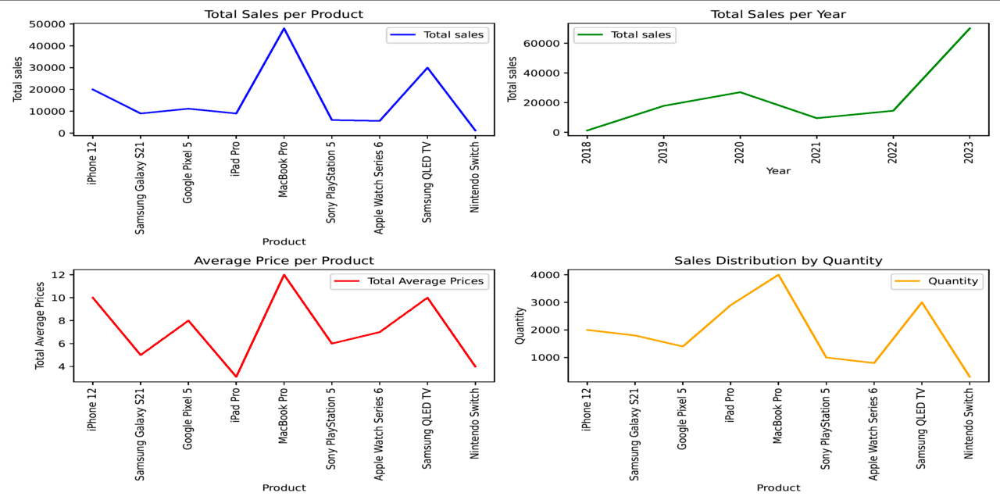

# Sales Report Generation

## Project Objective

The goal of this project is to generate a comprehensive sales report using sales data stored in a CSV file. The project aims to achieve the following steps:

1. **Data Extraction**: Retrieve sales data from a CSV file and load it into a pandas DataFrame.
2. **Data Preparation**: Clean the data by removing any missing values or irrelevant columns.
3. **Data Storage**: Store the cleaned data in a SQLite database using the `sqlite3` module.
4. **Data Analysis**: Perform data analysis on the sales data to generate insights and metrics such as total sales per product, total sales per year, average prices per product, and sales distribution by quantity.
5. **Data Visualization**: Utilize the `matplotlib` library to create visualizations such as line charts for each metric, showcasing the sales trends and patterns.
6. **Report Generation**: Generate a comprehensive sales report in PDF format, containing the visualizations and key findings.
7. **Data Persistence**: Store the processed metrics and insights into separate database tables for future reference and analysis.

By completing these steps, the project provides valuable insights into the sales performance, trends, and distribution, enabling data-driven decision-making and strategic planning for the business.

Follow the steps below to generate a sales report.

## Step 1: Clone the Repository

Clone the repository using the following command:
 <em><strong>git clone https://github.com/EeswarKV/pandas_sales_report</em></strong>

## Step 2: Install Dependencies

Navigate to <em><strong>salesreport</em></strong> package and make sure to install the dependencies specified in the requirements.txt file. You can install them using the following command:
 <em><strong>pip install -r requirements.txt</em></strong>

## Step 3: Run main.py

Navigate to the project directory and run the 'main.py' script:
 <em><strong>python main.py</em></strong>
  This will execute the script and generate the sales report.  

## Step 4: Check the Generated Sales Report in PDF

After running the script, check the generated sales report in PDF format. The report should be saved in the specified location.
 <em><strong>sales_report.pdf</em></strong>  

That's it! You have successfully generated the sales report.
